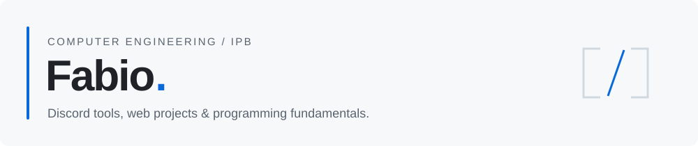

<picture>
  <source media="(prefers-color-scheme: dark)" srcset="assets/header-dark.svg">
  
</picture>

I'm a **Computer Engineering student at IPB**, building Discord tools, web projects and practical applications while developing my programming foundations.

### Selected work

| Project | What you'll find |
| --- | --- |
| **[+1BOT](https://github.com/fabioxyz/-1BOT)** | A Discord support system with departments, ticket workflows, audit logs and HTML transcripts. **Node.js · SQLite** |
| **[BigStore Website](https://github.com/fabioxyz/BigStore-Website)** | A responsive storefront with Portuguese and English content. **HTML · CSS · JavaScript** |
| **[Student Management](https://github.com/fabioxyz/gestao-estudantes-java)** | An early console application exploring classes, encapsulation and collections. **Java** |

### Foundations & coursework

**[C project collection](https://github.com/fabioxyz/projetos-c)** — terminal games, utilities and customer management, organized in one index.

**[Computer Networks I](https://github.com/fabioxyz/Redes-Computadores-I)** — Cisco Packet Tracer coursework covering addressing, routing and switching.

### Working with

`JavaScript` `Node.js` `discord.js` `SQLite` `C` `Java` `HTML & CSS` `Git`

---

Projects, experiments and coursework. Each repository documents its scope and current state.
